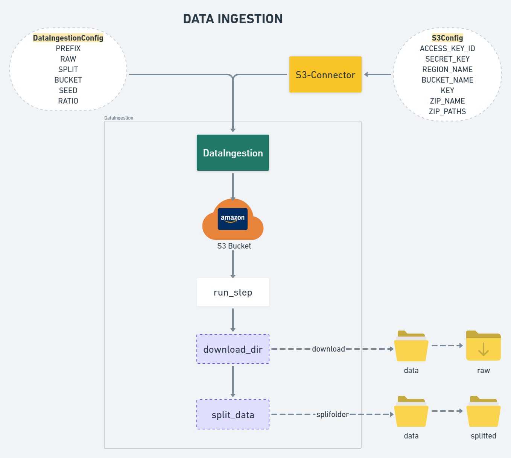
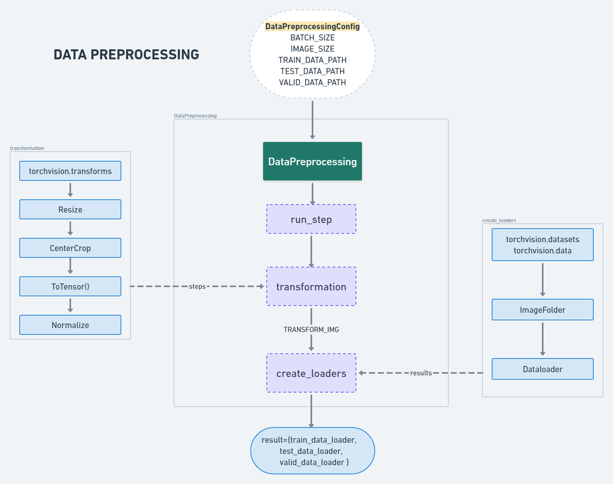
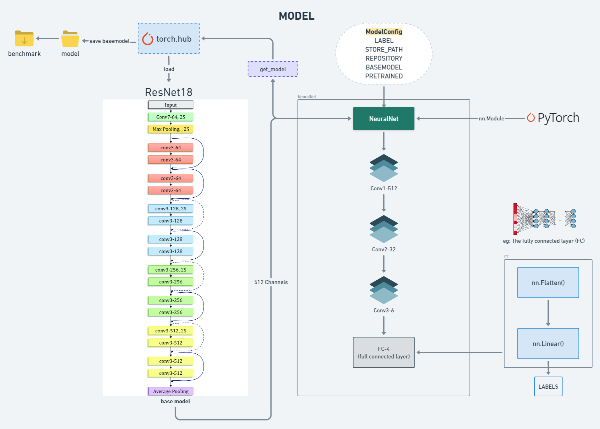
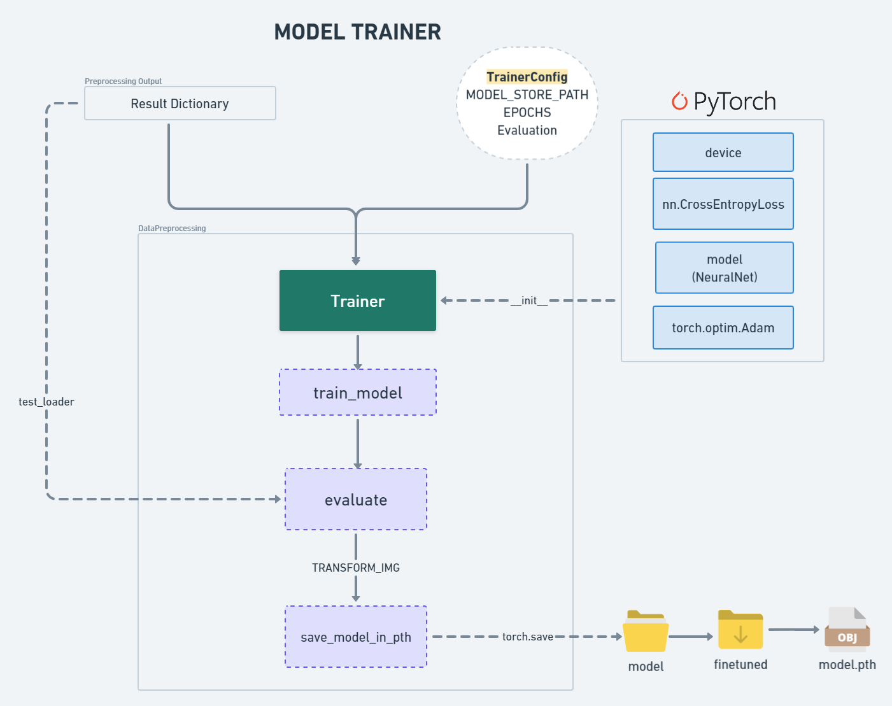
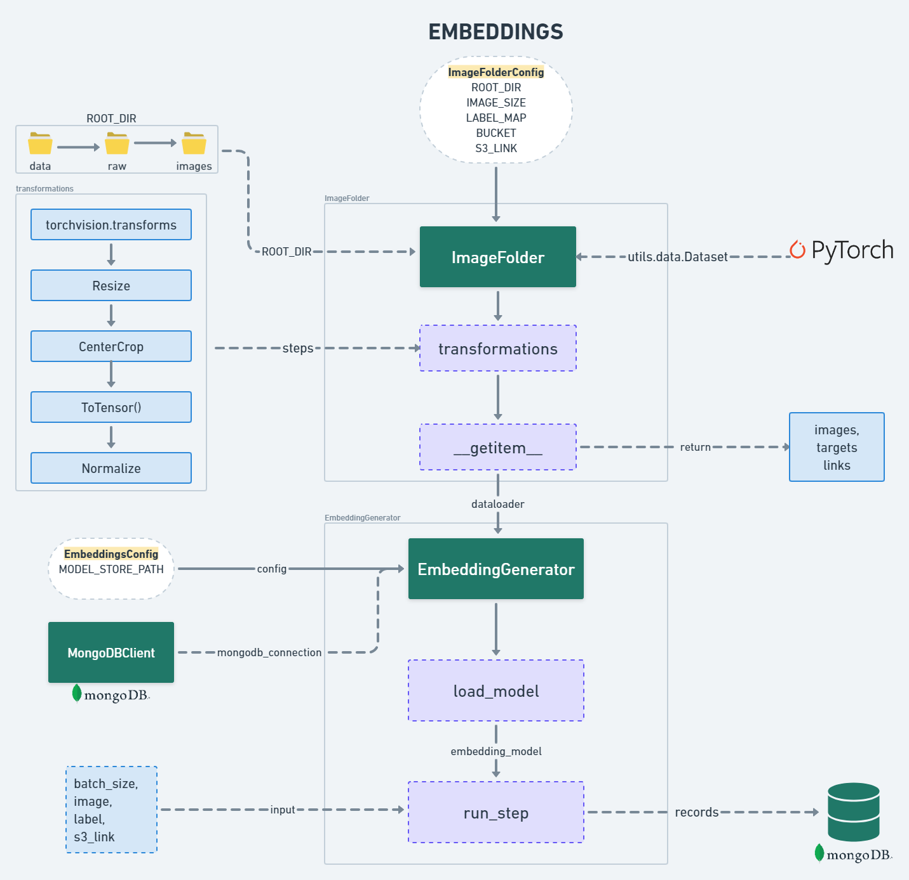
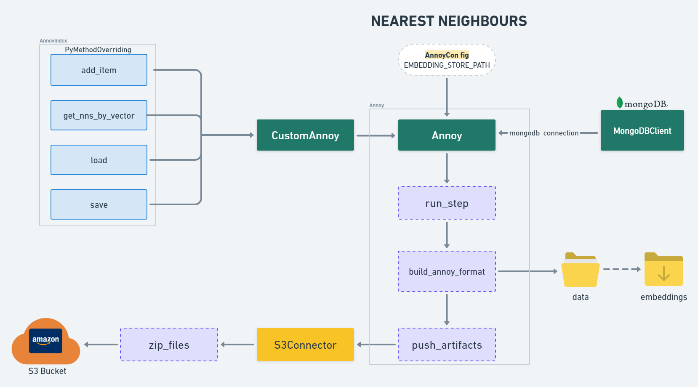

# **Model Training Endpoint**

This repository is the **Model Training Endpoint**, a key part of the **De-Coupled Microservice Architecture** for implementing an **Image Similarity Search System**. The main objective of this endpoint is to train a deep learning model (ResNet18) on the **Caltech-101 dataset**, generate embeddings for all images, and store the results for later use in the prediction phase.

---

## **Overview**

The **Model Training Endpoint** performs the following tasks:

1. **Data Ingestion**:  
   Fetches images from an **S3 bucket** and splits the data for training and testing.

2. **Data Preprocessing**:  
   Applies image transformations such as resizing, cropping, and normalization to prepare the data.

3. **Model Training**:  
   Fine-tunes the **ResNet18** model using the PyTorch framework on the Caltech-101 dataset.

4. **Embedding Generation**:  
   Generates embeddings for all images by removing the classification layer and passing images through the trained model.

5. **ANN Integration**:  
   Stores embeddings and their metadata into **MongoDB** and an ANN index for approximate nearest neighbor search.

6. **Artifact Storage**:  
   Saves the trained model and embedding artifacts in an **S3 bucket**.

---

## **Workflow**

### 1. **Data Ingestion**
   The process begins by fetching the images from the S3 bucket and splitting them into training, validation, and testing datasets.

   **Flowchart**:  
   

   **Key Steps**:  
   - **Configuration**: Set parameters like bucket name, prefix, split ratio, and seed.  
   - **Download and Split**: Download raw images into a directory and split them into separate folders for training and validation.  
   - **Outputs**:  
     - Raw data folder  
     - Split data folder (train/test/valid)

---

### 2. **Data Preprocessing**
   Once data is ingested, it is preprocessed for model training. This step includes image transformations.

   **Flowchart**:  
   

   **Key Steps**:  
   - **Transformations**:  
     - Resize images  
     - Center crop  
     - Convert images to tensors  
     - Normalize pixel values  
   - **Loaders**: Create data loaders using `torchvision.datasets` and `DataLoader` for efficient batching.  
   - **Outputs**:  
     - Data loaders for training, validation, and testing  

---

### 3. **Model Training**
   The ResNet18 model is fine-tuned using the preprocessed data.

   **Flowchart**:  
   

   **Key Steps**:  
   - **Base Model**: Load the pretrained **ResNet18** model from `torch.hub`.  
   - **Customization**: Modify the last layer to suit the 101 classes of the Caltech-101 dataset.  
   - **Training**: Fine-tune the model using PyTorch's `torch.nn` and `torch.optim`.  
   - **Loss Function**: CrossEntropyLoss is used to compute loss.  
   - **Outputs**:  
     - Fine-tuned model saved as a `.pth` file.  

---

### 4. **Model Trainer**
   The trainer module handles the actual model training process.

   **Flowchart**:  
   

   **Key Steps**:  
   - Initialize the trainer with configurations (epochs, optimizer, loss function).  
   - **Train the Model**:  
     - Train the model using the training dataset.  
     - Evaluate the model performance on the test dataset.  
   - Save the trained model to an S3 bucket.  

---

### 5. **Embedding Generation**
   After training, embeddings are generated for all images by removing the final classification layer from the model.

   **Flowchart**:  
   

   **Key Steps**:  
   - Load the fine-tuned model and remove the final layer.  
   - Pass all images through the model to generate **embedding vectors** (384 dimensions).  
   - Save the embeddings and corresponding metadata (image URL, label) into **MongoDB**.  
   - Store embeddings as an ANN-compatible file.  

---

### 6. **Nearest Neighbors (ANN Integration)**
   The embeddings are indexed using the Approximate Nearest Neighbors (ANN) algorithm for efficient similarity search.

   **Flowchart**:  
   

   **Key Steps**:  
   - Use `Annoy` to create and index embeddings.  
   - Store the ANN index and metadata artifacts in the S3 bucket.  
   - Save embedding records to MongoDB.  
   - Outputs:  
     - ANN file (embeddings.ann)  
     - MongoDB metadata  

---

## **Technologies Used**

- **Python**  
- **PyTorch**: Deep Learning framework  
- **Torchvision**: Image transformations and dataset loading  
- **AWS S3**: Cloud storage for artifacts  
- **MongoDB**: Storing metadata and embeddings  
- **Annoy**: Approximate Nearest Neighbors (ANN) implementation  

---

## **Setup Instructions**

```bash
1. **Clone the Repository**:  
   git clone <repo-link>
   cd model-training-endpoint

2. **Install Dependencies**:  
   pip install -r requirements.txt

3. **Environment Configuration**:  
   - Configure S3 bucket credentials in a `.env` file.  
   - Set MongoDB connection strings and ANN paths.

4. **Run Data Ingestion**:  
   python data_ingestion.py

5. **Run Data Preprocessing**:  
   python data_preprocessing.py

6. **Train the Model**:  
   python train_model.py

7. **Generate Embeddings**:  
   python generate_embeddings.py
